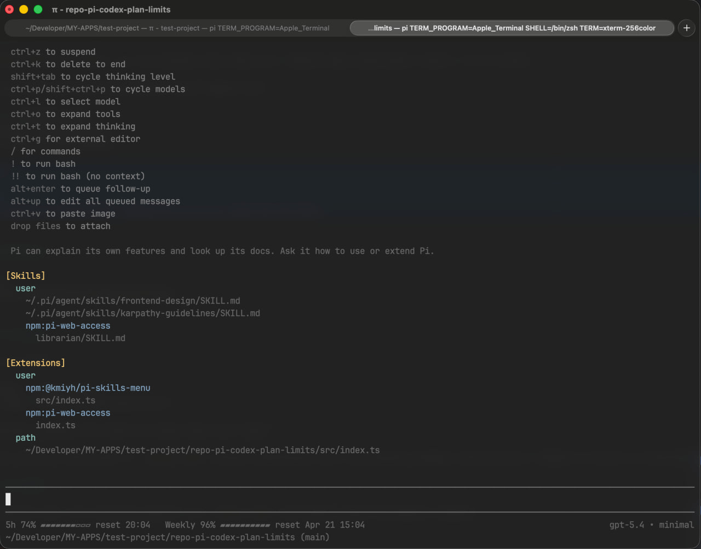

# @kmiyh/pi-codex-plan-limits

`@kmiyh/pi-codex-plan-limits` is a Pi extension that shows your **OpenAI Codex subscription limits** in Pi's footer.

It replaces the less useful subscription footer segment with:

- **5h** remaining limit
- **Weekly** remaining limit
- reset time for both windows



## Installation

```bash
pi install npm:@kmiyh/pi-codex-plan-limits
```

## What it does

When Pi is using:

- provider: `openai-codex`
- auth mode: **OAuth / subscription auth**

the extension modifies the footer and shows Codex plan limits.

If Pi is using any other model, or `openai-codex` without subscription auth, the extension disables itself and the **default Pi footer is restored**.

## How it works

The extension uses **Pi's own auth session** for `openai-codex` and fetches usage from OpenAI's backend:

```text
https://chatgpt.com/backend-api/wham/usage
```

It does **not** depend on a separate Codex CLI login and does **not** read `~/.codex/sessions`.

If a live refresh fails, it keeps the last successful snapshot fetched through Pi.

## Refresh behavior

The limits are refreshed:

- on session start
- when the model changes
- after turns finish
- every 60 seconds

Event-driven refreshes are throttled to avoid excessive requests.

## Local development

```bash
npm install
npm run typecheck
```

For testing:

```bash
pi -e ./src/index.ts
```

## License

MIT
